# Network manager

Network manager creates, manages and releases instance networks natively — bridge/veth, network
namespaces, nftables, tc and a per-bridge dnsmasq — driving every step through interfaces rather
than external CNI plugins. It separates the network lifecycle into logical (CM communication, DB
persistence) and physical (bridge/VLAN, namespace, interface attach, firewall/bandwidth/DNS,
monitoring) operations to support offline SM operation and clean reboot recovery.

This module owns the orchestration and the interface contracts only; the concrete platform
implementations of the interfaces below live in `aos_core_cpp` (and are documented there).

## Lifecycle

- **Init**: wires the dependencies — `StorageItf`, `BridgeNetworkItf`, `FirewallItf`,
  `BandwidthItf`, `DNSNameItf`, `TrafficMonitorItf`, `NamespaceManagerItf`, `InterfaceManagerItf`,
  `crypto::RandomItf`, `InterfaceFactoryItf`, `NetworkProviderItf`, and the node ID.
- **Start**: starts the firewall (`FirewallItf::Start`) and traffic monitor
  (`TrafficMonitorItf::Start`), reaps DNS servers for networks no longer in storage
  (`DNSNameItf::RemoveOrphans`), then reconciles on-host state with the DB
  (`CleanupLeftoverInstances`).
- **Stop**: tears the stack back down.

## Functionality

### Instance network operations

- **CreateInstanceNetwork**: Logical network creation (CM + DB). This method:
  - Ensures the node network exists (requests parameters from CM via `NetworkProviderItf`, stores
    in DB)
  - Allocates the instance IP address from CM via `NetworkProviderItf`
  - Stores network config and allocated parameters in DB and internal cache
  - Returns `eAlreadyExist` if the instance network is already created
  - Does NOT create bridge/VLAN, namespace, or attach the instance

- **StartInstanceNetwork**: Physical network setup (local, no CM calls). This method:
  - Ensures the node network's bridge/VLAN exists, creating it via `InterfaceFactoryItf`, and that
    its DNS server is running via `DNSNameItf::CreateServer` (one dnsmasq per network)
  - Creates the instance's network namespace via `NamespaceManagerItf`
  - Attaches the instance and installs its configuration, in order:
    - `BridgeNetworkItf::Attach` — veth pair, attach host end to the bridge, move the peer into the
      netns, configure IP/route; returns the host-side veth name
    - `FirewallItf::AddInstance` — per-instance firewall rules
    - `BandwidthItf::Apply` — traffic shaping on the host-side veth
    - `DNSServerItf::AddHost` — register the instance IP and aliases
    - `TrafficMonitorItf::StartInstanceMonitoring` — start accounting
  - Reads network config and allocated parameters from DB / internal cache

- **StopInstanceNetwork**: Physical network teardown (local, no CM calls). Reverses the setup:
  `TrafficMonitorItf::StopInstanceMonitoring` → `DNSServerItf::RemoveHost` → `BandwidthItf::Clear`
  → `FirewallItf::RemoveInstance` → `BridgeNetworkItf::Detach` → delete the namespace. If this is
  the last running instance on the network, clears the bridge/VLAN and removes its DNS server
  (`DNSNameItf::RemoveServer`). Does NOT remove from DB, does NOT call CM.

- **ReleaseInstanceNetwork**: Logical network release (DB + CM). This method:
  - Requires `StopInstanceNetwork` to be called first
  - Removes instance network info from DB and internal cache
  - Releases the instance network on CM via `NetworkProviderItf`
  - Removes node network info from DB and releases it on CM if it was the last instance on the
    network

- **GetNetnsPath**: Returns the filesystem path to the network namespace for a given instance.

### Traffic monitoring

- **GetInstanceTraffic**: Returns the current input and output traffic statistics for a specific
  instance.

- **GetSystemTraffic**: Returns the aggregate input and output traffic statistics for all instances.

- **SetTrafficPeriod**: Configures the traffic monitoring period (minute, hour, day, month, year)
  for traffic accounting.

### Persistence and reboot recovery

Network and instance state is persisted through `StorageItf` (`AddNetworkInfo`,
`AddInstanceNetworkInfo`, `UpdateInstanceNetworkInfo`). The instance record carries the host-side
veth name (`mHostIfName`) returned by `BridgeNetworkItf::Attach`, so teardown can act on the right
interface after a restart.

On `Start`, recovery reconciles the host with the DB without any CM calls:

- `DNSNameItf::RemoveOrphans` reaps dnsmasq state for networks released while SM was down;
  `DNSNameItf::CreateServer` adopts a still-running dnsmasq for a known network or respawns it.
- `CleanupLeftoverInstances` tears down host state (bridge/firewall/bandwidth/monitoring) for
  instances no longer present, using the persisted `mHostIfName` to clear shaping on the correct
  host-side veth.

## Interfaces

It implements the following interfaces:

- [aos::sm::networkmanager::NetworkManagerItf][networkmanager-itf] - main network manager
  functionality.

It requires the following interfaces:

- [aos::networkmanager::NetworkProviderItf][networkprovider-itf] - provides network parameters from
  CM (node network params, instance IP allocation/release).
- [aos::sm::networkmanager::StorageItf][storage-itf] - stores and retrieves network configuration
  and traffic data.
- [aos::sm::networkmanager::BridgeNetworkItf][bridgenetwork-itf] - attaches/detaches instances to
  the bridge (veth pair, IPMasq).
- [aos::sm::networkmanager::FirewallItf][firewall-itf] - per-instance firewall rules and masquerade.
- [aos::sm::networkmanager::BandwidthItf][bandwidth-itf] - per-instance bandwidth shaping.
- [aos::sm::networkmanager::DNSNameItf][dnsname-itf] - factory of per-network DNS servers; each
  [aos::sm::networkmanager::DNSServerItf][dnsname-itf] handle adds/removes instance hosts.
- [aos::sm::networkmanager::TrafficMonitorItf][trafficmonitor-itf] - monitors network traffic for
  instances.
- [aos::sm::networkmanager::NamespaceManagerItf][namespacemanager-itf] - manages network namespaces.
- [aos::sm::networkmanager::InterfaceManagerItf][interfacemanager-itf] - manages network interfaces.
- [aos::sm::networkmanager::InterfaceFactoryItf][interfacefactory-itf] - creates network interfaces
  (bridges, VLANs).
- [aos::common::crypto::RandomItf][random-itf] - generates random values.

[networkmanager-itf]: itf/networkmanager.hpp
[networkprovider-itf]: ../../common/networkmanager/itf/networkprovider.hpp
[storage-itf]: itf/storage.hpp
[bridgenetwork-itf]: itf/bridgenetwork.hpp
[firewall-itf]: itf/firewall.hpp
[bandwidth-itf]: itf/bandwidth.hpp
[dnsname-itf]: itf/dnsname.hpp
[trafficmonitor-itf]: itf/trafficmonitor.hpp
[namespacemanager-itf]: itf/namespacemanager.hpp
[interfacemanager-itf]: itf/interfacemanager.hpp
[interfacefactory-itf]: itf/interfacefactory.hpp
[random-itf]: ../../common/crypto/itf/rand.hpp

```mermaid
classDiagram
    class NetworkManager ["aos::sm::networkmanager::NetworkManager"] {
    }

    class NetworkManagerItf ["aos::sm::networkmanager::NetworkManagerItf"] {
        <<interface>>
    }

    class NetworkProviderItf ["aos::networkmanager::NetworkProviderItf"] {
        <<interface>>
    }

    class StorageItf ["aos::sm::networkmanager::StorageItf"] {
        <<interface>>
    }

    class BridgeNetworkItf ["aos::sm::networkmanager::BridgeNetworkItf"] {
        <<interface>>
    }

    class FirewallItf ["aos::sm::networkmanager::FirewallItf"] {
        <<interface>>
    }

    class BandwidthItf ["aos::sm::networkmanager::BandwidthItf"] {
        <<interface>>
    }

    class DNSNameItf ["aos::sm::networkmanager::DNSNameItf"] {
        <<interface>>
    }

    class DNSServerItf ["aos::sm::networkmanager::DNSServerItf"] {
        <<interface>>
    }

    class TrafficMonitorItf ["aos::sm::networkmanager::TrafficMonitorItf"] {
        <<interface>>
    }

    class NamespaceManagerItf ["aos::sm::networkmanager::NamespaceManagerItf"] {
        <<interface>>
    }

    class InterfaceManagerItf ["aos::sm::networkmanager::InterfaceManagerItf"] {
        <<interface>>
    }

    class InterfaceFactoryItf ["aos::sm::networkmanager::InterfaceFactoryItf"] {
        <<interface>>
    }

    class RandomItf ["aos::common::crypto::RandomItf"] {
        <<interface>>
    }

    NetworkManager ..|> NetworkManagerItf

    NetworkManager ..> NetworkProviderItf
    NetworkManager ..> StorageItf
    NetworkManager ..> BridgeNetworkItf
    NetworkManager ..> FirewallItf
    NetworkManager ..> BandwidthItf
    NetworkManager ..> DNSNameItf
    NetworkManager ..> TrafficMonitorItf
    NetworkManager ..> NamespaceManagerItf
    NetworkManager ..> InterfaceManagerItf
    NetworkManager ..> InterfaceFactoryItf
    NetworkManager ..> RandomItf

    DNSNameItf ..> DNSServerItf : creates
```

